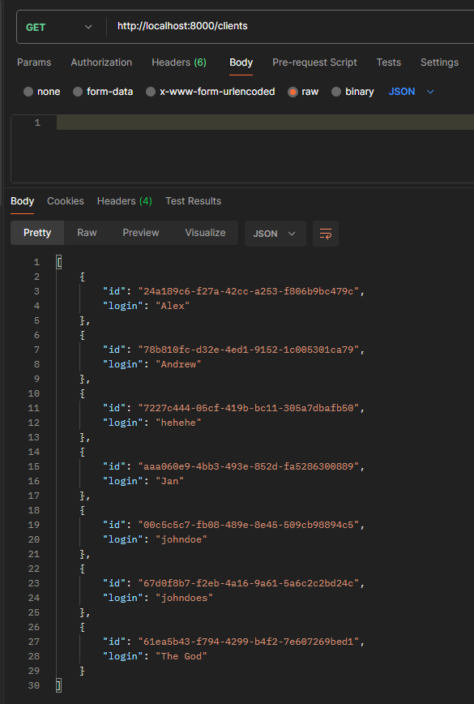
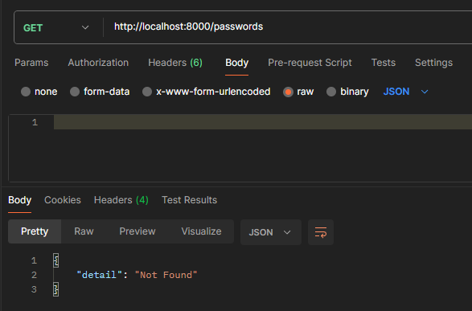
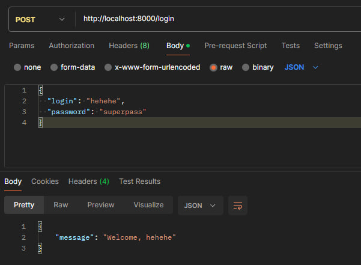
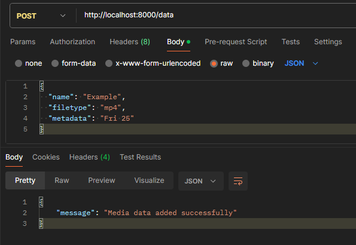
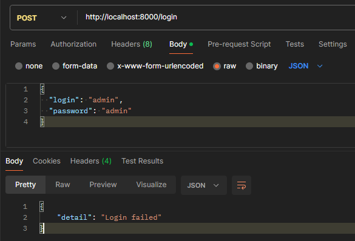
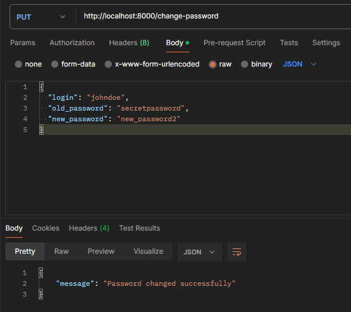
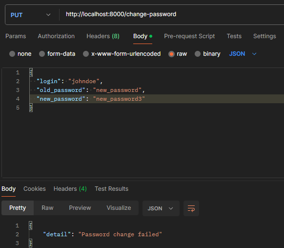
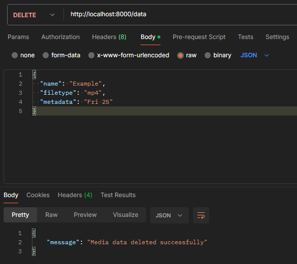
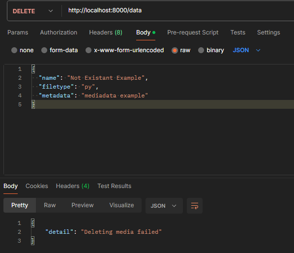

# Тестування працездатності системи

# Тестування працездатності системи

## GET

### З правильними даними

  

### З неправильними даними

  

## POST

### З правильними даними

  

  

### З не правильними даними

  

## PUT

### З правильними даними

  

### З неправильними даними

  

## DELETE

### Успішне видалення

  

### Неуспішне видалення

  

